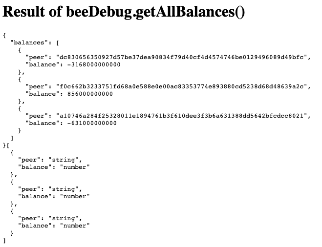

# Test for bigint in browser

### Prerequisites

 - Node and NPM
 - Bee instance running with debug API port on 1635 and having flag `--cors-allowed-origins="*"`

### Steps:

1. Run `npm install` and `npm start`

Checkout the browser console or the html code.

